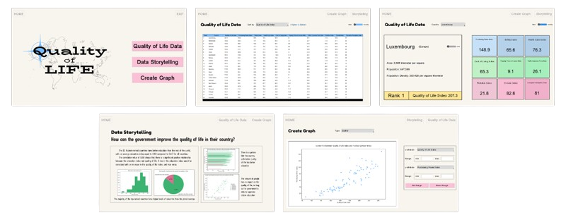

# Quality of Life by country

 
<br>

### Description

&nbsp;&nbsp;&nbsp;&nbsp;&nbsp;&nbsp;&nbsp;There are three parts of my project. The first section contains data on quality of life, which is presented in three formats: 
table data, data for each country, and descriptive data. You can get information on each country's quality of life index, 
along with other variables considered while calculating it, by looking at table data and data by country. In the second part is data storytelling, 
I provide my analysis from the data regarding how the country's standard of education affects people's quality of life. In the third section, 
you can create your own graph by selecting the graph type and other necessary attributes.

<br>

### The Application


<br>

### Installation and Setup
**for virtual environment**


Clone the git repository
```
git clone https://github.com/ParimaSA/Quality-of-Life.git
```
Change to the repository
```
cd Quality-of-Life
```
Create and activate a virtual environment (activate with .\env\Scripts\activate if you are on MS Windows)
```
python -m venv env
. env/bin/activate
```
Install the requirement packages using in this App
```
pip install -r requirements.txt
```

### How to run the application
run the file main.py
```
python main.py
```

<br>

### Project Documents

* [Project Proposal](https://docs.google.com/document/d/1wn12IJUeAvIHc4JqrAbHlYGXNEEokNY0FmROQMaQSRM/edit)

* [Development Plan](https://github.com/ParimaSA/Quality-of-Life/wiki/Development-Plan)

* [Design Pattern and UML Diagrams](https://github.com/ParimaSA/Quality-of-Life/wiki/Design-Documents-and-UML-Diagrams)

<br>


### Data Source

* Quality of Life

	* [Quality of Life Index by Country 2024](https://www.numbeo.com/quality-of-life/rankings_by_country.jsp)

* Data of each country

	* [World Population Dataset](https://www.kaggle.com/datasets/iamsouravbanerjee/world-population-dataset)

	* [Education Index](https://worldpopulationreview.com/country-rankings/education-index-by-country) 
